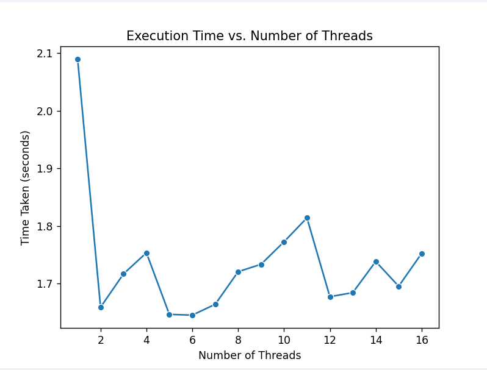
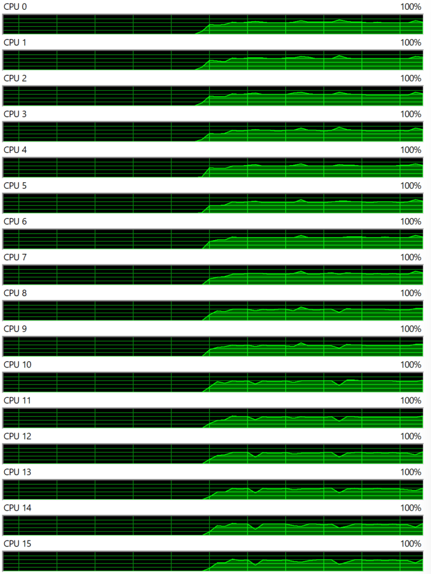

# Multi-Threading Assignment

## Submitted By:
- **Name:** Chirag Gupta  
- **Roll Number:** 102103278 
- **Group:** 3COE10

## Introduction
My workstation contains 8 cores i.e 16 threads and this Python script performs matrix multiplication with multithreading. It will utilise all the threads to perform the given task. It calculates the product of 100 random matrices of size 1000x1000 with a constant matrix of the same size using multiple threads. It also measures the time taken for multiplication with different thread counts (No. of threads = 2 x No. of cores).

## Prerequisites
- Python 3.xx
- NumPy      `pip install numpy`
- psutil     `pip install psutil`
- seaborn    `pip install seaborn`

## Methodolgy
1. **Matrix Generation:** Random matrices of different sizes and quantities are generated using NumPy's random number generation capabilities. These matrices act as the input data for the matrix multiplication experiments.
2. **Benchmarking:** The project conducts benchmarking experiments to assess the performance of matrix multiplication algorithms. By varying the number of threads and observing the resulting changes in execution time, the project examines how multi-threading impacts computation speed and efficiency.
3. **Performance Analysis:** Following the benchmarking experiments, the results are analyzed to gain insights into the scalability and effectiveness of multi-threading in accelerating matrix multiplication operations. Performance metrics such as execution time, speedup, efficiency, and CPU utilization are computed and evaluated. This comprehensive analysis provides a detailed assessment of multi-threaded matrix multiplication algorithms.

## Results 
1. Tabular (Number of threads Vs Time Taken)
   
| No. of Threads | T=1 | T=2 | T=3 | T=4 | T=5 | T=6 | T=7 | T=8 | T=9 | T=10 | T=11 | T=12 | T=13 | T=14 | T=15 | T=16 |
|---------|-----|-----|-----|-----|-----|-----|-----|-----|-----|------|------|------|------|------|------|------|
| Time Taken (Sec) | 2.4259 | 1.6529 | 1.7440 | 1.7935 | 1.7069 | 1.7754 | 1.9557 | 1.7685 | 1.8954 | 1.9885 | 1.8642 | 1.8296 | 1.7640 | 1.7633 | 1.9382 | 1.8222 | 

2. Graphical 
 - Number of threads Vs Time Taken
   
   

   This plot showcases the relationship between the number of threads and the execution time of matrix multiplication operations. It highlights how multi-threading affects computation speed and efficiency.

 - CPU Thread usage
   
   

   This plot shows CPU utilization over the course of matrix multiplication experiments. It shows the utilisation of each cpu thread during the execution of matrix multiplication.
